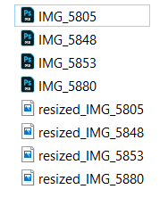

# Mass resizing and adding watermark script
JS script for Photoshop

### Features 
* Checking the existance of the watermark file
* Checking if any photoshop files are open
* Mass photo resizing on their largest side
* Adding the watermark
* Resizing the watermark
* Moving the watermark at the bottom center of the photos
* Flattening all the layers
* Saving as JPG
* Closing original files without changes
* Alerting "Done!" after all the photos are saved

# Sample
Before/ After screenshots of the lower part of the photo

Before/ After screenshots of the folder containing photos

